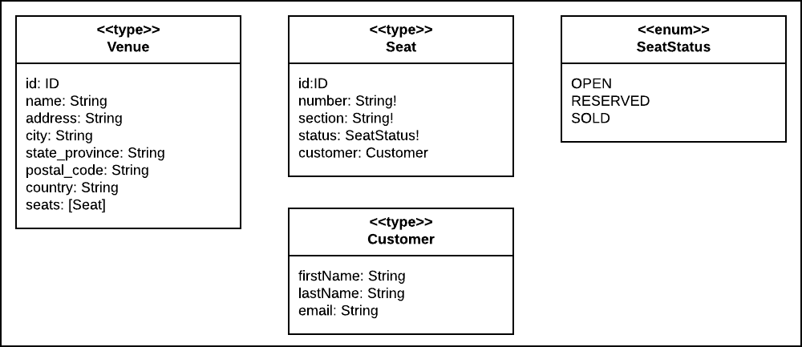
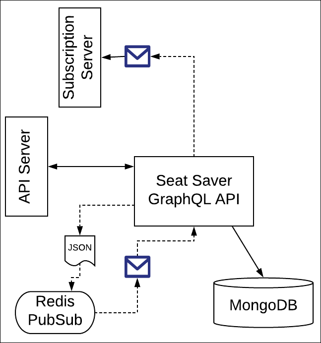
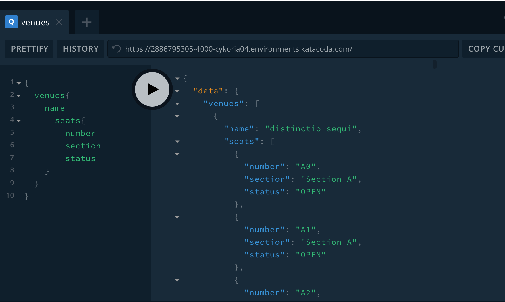
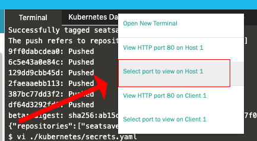
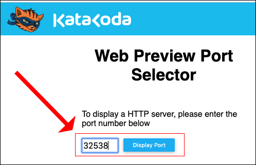
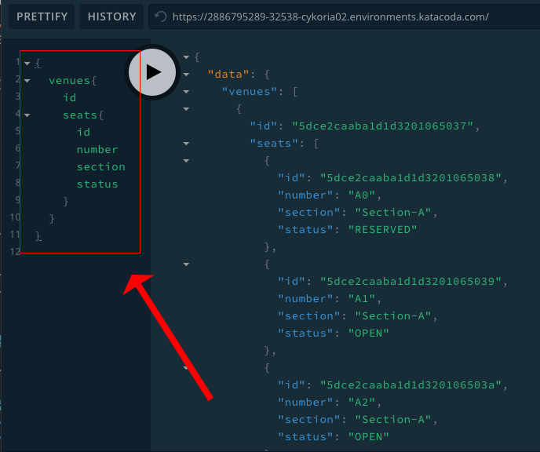

# Seat Saver

Seat Saver is a project that demonstrates how to implement high volume message streaming under GraphQL.

Seat Saver in an GraphQL API that provides seat reservations services. The API exposes a set of types that describe seats in a venue, as shown in the figure below:



The Seat Saver API allows developers to reserve and then buy a seat in within a given venue. Also, the Seat Saver API publishes a set of subscriptions that provides streams of messages according to events. These events are:

* `onSeatReserved`
* `onSeatSold`
* `onSeatReleased`

**NOTE:** Seat Saver will automatically inject preliminary seed data into the datastore upon startup. This seed data describes 3 venues with each venue having a number of seats accordingly.

There are three ways to get the Seat Save project up and running. The **first way** is to use a Docker Compose installation on a single host machine. The Docker Compose installation will install an instance of MongoDB and Redis as containers on the host machine.

The **second way** is to run Seat Saver has a multi-instance distributed application in a Kubernetes cluster. To do this you will need to have created or identified a MongoDB database server (or server cluster) with an exposed endpoint URL. This endpoint URL is assigned to the application's environment variable `MONGODB_URL `

Also, you will need to have created or identified an Redis message broker server or server cluster that has an endpoint exposed to the internet. This endpoint is assigned to the application's environment variable `MESSAGE_BROKER_HOST`. Seat Saver will support the default port number for Redis, `6379` by default. Should you decide to use an alternate port, then you need to see this port number needs to be assigned to the application's environment variable, `MESSAGE_BROKER_PORT`.

The **third way** is to install Seat Saver as a standalone application on the host. This method requires configuring Seat Saver with references to running instances of MongoDB and Redis. These instances can be out on the internet or on an internal network. The references to MongoDB and Redis are defined by their URLs. Typically these URLs will contain username/password information.

These URLs need to be assigned to specific environment variables on the host machine(s) where Seat Saver is running.

## General Architecture
Seat Saver is a GraphQL API written under Apollo Server. It relies upon access to a MongoDB database and a Redis PubSub Message broker. The MongoDB database is used to store data. The Redis message broker is the backing service that supports the physical message emission from the various subscriptions available via the Seat Saver subscription server.

.

These backing services can exist anywhere, locally or on the internet, as long as the given service can be reached according to a URL.


## Seat Saver Environment Variables

The environment variable for the MongoDB reference is:

`MONGODB_URL`, the URL that describes the location the MongoDB server, along with the username and password should those be required.

The environment variables for the Redis reference are:

`MESSAGE_BROKER_HOST` : The URL the defines the location of the Redis server message broker used by Seat-Saver 

`MESSAGE_BROKER_PORT` (optional), the port number associated with the Redis server. The default value is `6379`.

`MESSAGE_BROKER_PASSWORD` (optional), the password, should one be required by Redis

The sections that follow decribe how to setup Seat Saver as an application running under Docker Componse as well as running Seat Saver as a standalone application with references to MongoDB and Redis.

Also, there are sections that follow that provide examples for working with GraphQL `queries`, `mutations` and `subscriptions` in the Seat Saver API.


## Running Seat Saver as a Docker Compose Application

(You can run this project under a Katabcoda Ubuntu Playground. Click [here](https://katacoda.com/courses/ubuntu/playground) to
go to the Ubuntu Playground.)

**Step 1:** Clone the source into your host machine.

`git clone https://github.com/programmableweb/seat-saver`

**Step 2:** Go to the project directory

`cd seat-saver`

**Step 3:** Spin up the `docker-compose` project

`docker-compose up`

Seat saver will be running on port `4000`.



## Running Seat Saver as a Kubernetes Cluster

You can use a `minikube` instance of the Katacoda interactive learning environment to install and run `seat-saver` as distributed, multi-instance application under Kubernetes. The following URL links to Katacoda's `minikube` playground.

`https://katacoda.com/javajon/courses/kubernetes-fundamentals/minikube`

**Step 1:** Clone the source into your host machine.

`git clone https://github.com/programmableweb/seat-saver`

**Step 2:** Go to the project directory

`cd seat-saver`

**Step 3:** Run the bash script that creates a Docker repository on the local machine, creates the required Docker images from source code and adds them to the local Docker repository.

`sh docker-seed.sh`

You will get output similar to the following:

```text
Successfully tagged seatsaver:latest
The push refers to repository [localhost:5000/seatsaver]
9ff0dabcdea0: Pushed
6c5e43a0e84c: Pushed
129dd9cbb45d: Pushed
2faeaaebb113: Pushed
387bc77dd3f2: Pushed
df64d3292fd6: Pushed
beta: digest: sha256:ab15cd9bf6d5f9930c87fc40a373ad19da7f0651664f51ed28a1007af71c76e5 size: 1579
{"repositories":["seatsaver"]}
```

**Step 4:** Navigate to the `kubernetes` directory

`cd kubernetes`

**Step 5:** Adjust the Kubernetes secret manifest file, `./kubernetes/secrets.yaml` by adding the location of and access information for the MongDB and Redis services.

`vi secret.yaml`

```yaml
apiVersion: v1
kind: Secret
metadata:
  name: seatsaver-data
type: Opaque
data:
  mongodb_url: xxxxxxx
  message_broker_host: xxxxxxx
  message_broker_port: xxxxxxx
  message_broker_password: xxxxxx
```
Replace `xxxxxx` with the information particular to the environment variable.

**Step 6:** Run the bash script that creates the Kubernetes `secret`, `deployment`, and `service` for the Seat-Saver application.

`sh k8s-gen.sh`

You will get output as follows:

```text
secret/seatsaver-data created
deployment.extensions/seatsaver created
service/seatsaver created
```

**Step 7:** The Kubernetes service you installed is of `type: NodePort`. Thus, Kubernetes will assign an arbitrary port number over `30000` that binds to the port number exposed by the pod running the Seat-Saver container. To discover the NodePort port number type:

`kubectl get services`

You'll get output similar to the following:

```text
NAME         TYPE        CLUSTER-IP      EXTERNAL-IP   PORT(S)        AGE
kubernetes   ClusterIP   10.96.0.1       <none>        443/TCP        11m
seatsaver    NodePort    10.102.138.23   <none>        80:32538/TCP   3m57s
```
In the case above, the NodePort port number is `32538` and it binds to the pod/container port `80`. Your NodePort number will most likely be different.

**Be advised!** The Seat-Saver application seeds the MongoDB datasource you declare with seed data on first initialization. The ramification of this seeding is that it might take a little time for Seat-Saver to come online upon first startup. Subsequent startups of Seat-Saver will go much faster once the intial seeding has executed.

**Step 8:** Go to your web browser and access GraphQL Playground at the NodePort port number assigned by Kubernetes. If you are using Katacoda, go to `Select port to view on Host 1` by clicking the plus sign (+) on the Katacoda menu bar and then entering the NodePort port number.





**Step 9:** You will be taken to the GraphQL Playground web page. Enter the following GraphQL query:

```gql
{
  venues{
    id
    seats{
      id
      number
      section
      status
    }
  }
}
```

This query will list all the venues and seats avaiable for reservation.



You're now ready to exercise the Kubernetes installation of Seat Saver.

## Running Seat Saver as a Standalone Application

(If you like, you can run this code standalone from within the Katacoda Ubuntu Playground found [https://katacoda.com/courses/ubuntu/playground](https://katacoda.com/courses/ubuntu/playground).)

**Step 1:** Clone the Seat Saver source code from the GitHub repository.

`git clone https://github.com/programmableweb/seat-saver`

**Step 2:** Set the required environment variables as described in the section above, ***Seat Saver Environment Variables***.

```text
export MONGODB_URL=<some_value>
export MESSAGE_BROKER_HOST=<some_value>
export MESSAGE_BROKER_PORT=<some_value_optional>
export MESSAGE_BROKER_PASSWORD=<some_value_optional>
```
**Step 3:** Navigate to the directory that has the Seat Saver source  code.

`cd seat-saver`

**Step 4:** Install and run the application

`npm install`

`node index.js`

**Step 5:** Access the Seat Saver API via GraphQL Playground. To to your web browser and access the API via `localhost:4000`.

You're now ready to exercise the Seat Saver API via GraphQL Playground.

## Working with the Seat Saver API

The following decribes the basic GraphQL types defined with the Seat Saver API.

### Venue

```graphql
    type Venue {
        id: ID
        name: String
        address: String
        city: String
        state_province: String
        postal_code: String
        country: String
        seats: [Seat]
    }
```

### Seat

```graphql
  type Seat {
        id:ID
        number: String!
        section: String!
        status: SeatStatus!
        customer: Customer
    }
```

```graphql
    type Customer {
        firstName: String
        lastName: String
        email: String
    }
```

## Subscriptions and Mutations

The following describes some queries and mutations you can use against the Seat Saver API.

### Reserving a Seat

In order to make working with mutations against the Seat Saver API easier, you can use the following sample [query variable](https://blog.apollographql.com/the-anatomy-of-a-graphql-query-6dffa9e9e747).

```json
{
  "seat": {
    "venueId": "5dce2cabba1d1d320106525a",
    "number": "A0",
    "customer": {
      "firstName": "Gonzalo",
  		"lastName": "Considine",
  		"email": "Gonzalo.Considine@dagmar.name" 
    }
  }
}
```
----

**reserveSeat**

The following GraphQL mutation will reserve a seat and also generate a `SeatEvent` message to the subscription, `onSeatReserved`.

```graphql
mutation reserveSeat($seat: SeatInput!) {
  reserveSeat(seat: $seat) {
  	 id
    number
    section
    status 
  }
}
```

Output

```json
{
  "data": {
    "reserveSeat": {
      "id": "5dce2cabba1d1d320106525b",
      "number": "A0",
      "section": "Section-A",
      "status": "RESERVED"
    }
  }
}
```
----

**onSeatReserved**

In a separate browser window, execute the following GraphQL Query Language code to bind to the subscription, `onSeatReserved`.

```graphql
subscription onSeatReserved{
  onSeatReserved{
    venueId
    message
    number
    section
    status
    seatId  
  }
}
```

Sample Output

```json
{
  "data": {
    "onSeatReserved": {
      "venueId": "5dce2cabba1d1d320106525a",
      "message": "Reserving Seat",
      "number": "A0",
      "section": null,
      "status": "RESERVED",
      "seatId": null
    }
  }
}
```

### Buying a Seat

The following GraphQL mutation will buy a seat and also generate a `SeatEvent` message to the subscription, `onSeatSold`.

**buySeat**

```graphql
mutation buySeat($seat: SeatInput!) {
  buySeat(seat: $seat) {
  	 id
    number
    section
    status 
  }
}
```

Sample Output

```json
{
  "data": {
    "buySeat": {
      "id": "5dce2cabba1d1d320106525b",
      "number": "A0",
      "section": "Section-A",
      "status": "SOLD"
    }
  }
}
```
----
**onSeatSold**

In a separate browser window, execute the following GraphQL Query Language code to bind to the subscription, `onSeatSold`.

```graphql
subscription onSeatSold{
  onSeatSold{
    venueId
    message
    number
    section
    status
    seatId
  }
}
```

Sample Output

```json
{
  "data": {
    "onSeatSold": {
      "venueId": "5dce2cabba1d1d320106525a",
      "message": "Bought Seat",
      "number": "A0",
      "section": "Section-A",
      "status": "SOLD",
      "seatId": "5dce2cabba1d1d320106525b"
    }
  }
}

```
### Releasing a Seat

The following GraphQL mutation will release a seat from either `RESERVERED` or `SOLD` stati and also generate a `SeatEvent` message to the subscription, `onSeatReleased `.

**releaseSeat**

```graphql
mutation releaseSeat($seat: SeatInput!) {
  releaseSeat(seat: $seat) {
  	 id
    number
    section
    status 
  }
}
```

Output

```json
{
  "data": {
    "releaseSeat": {
      "id": "5dce2cabba1d1d320106525b",
      "number": "A0",
      "section": "Section-A",
      "status": "OPEN"
    }
  }
}
```

----
**onSeatReleased**

In a separate browser window, execute the following GraphQL Query Language code to bind to the subscription, `onSeatReleased `.

```graphql
subscription onSeatReleased{
  onSeatReleased{
    venueId
    message
    number
    section
    status
    seatId

  }
}
```

Output

```json
{
  "data": {
    "onSeatReleased": {
      "venueId": "5dce2cabba1d1d320106525a",
      "message": "Released Seat",
      "number": "A0",
      "section": "Section-A",
      "status": "OPEN",
      "seatId": "5dce2cabba1d1d320106525b"
    }
  }
}
```
